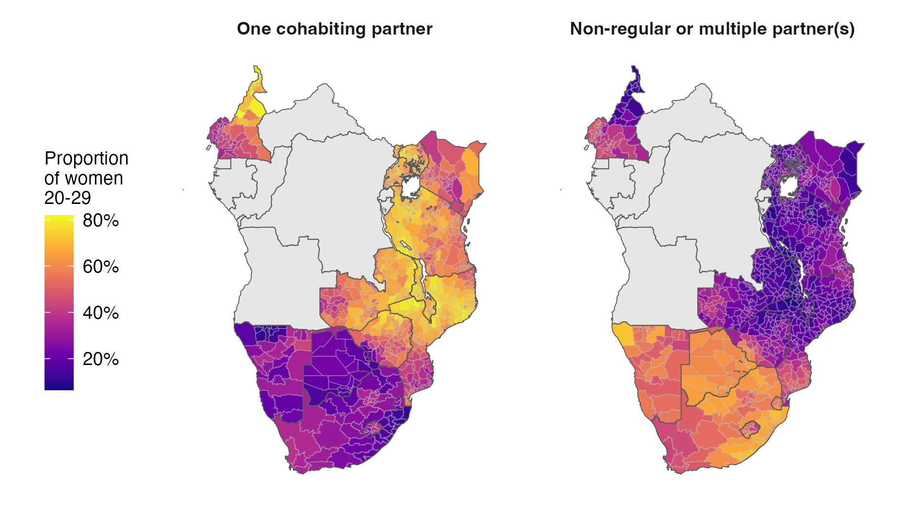
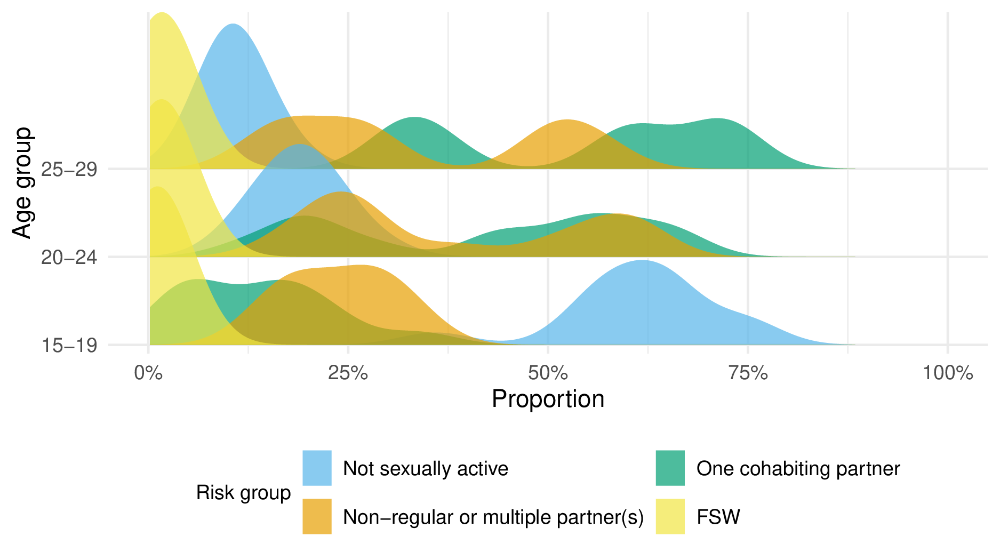
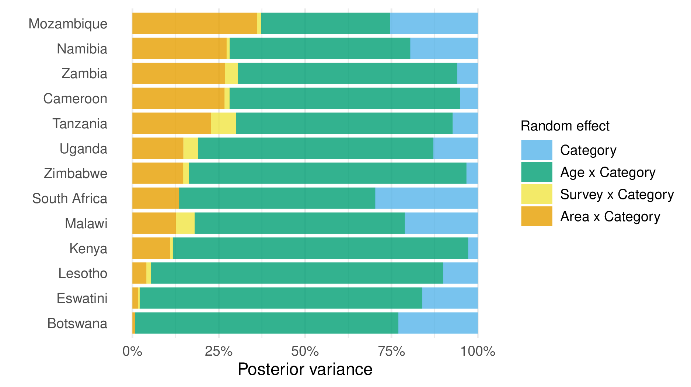
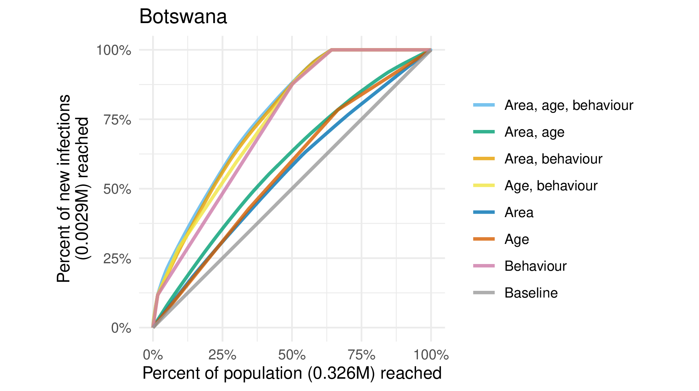
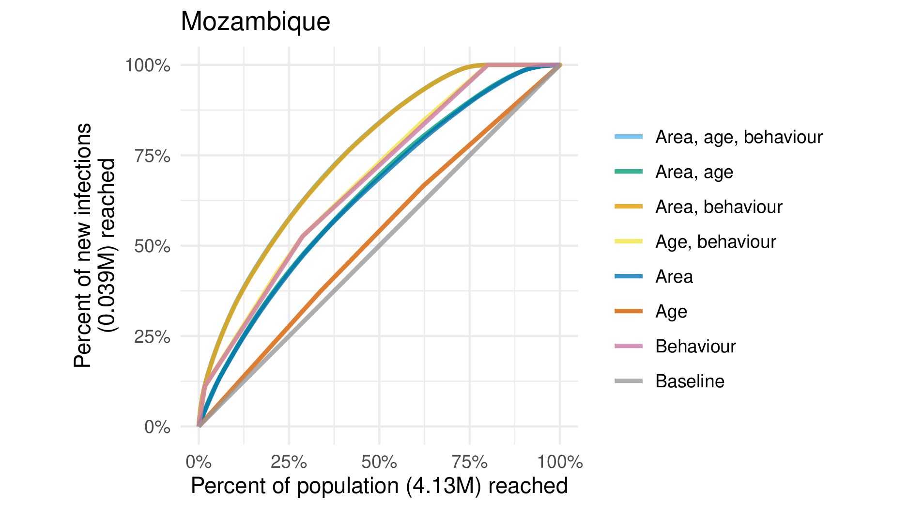
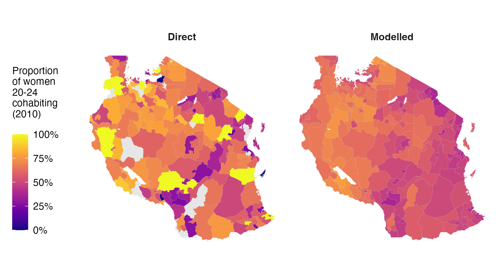
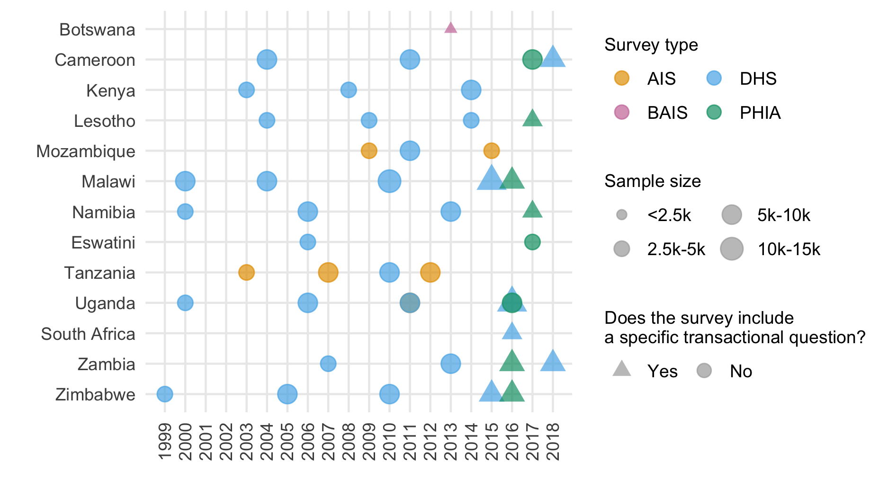
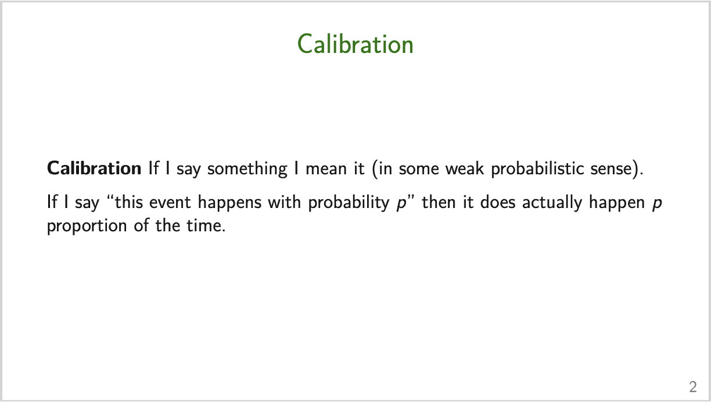
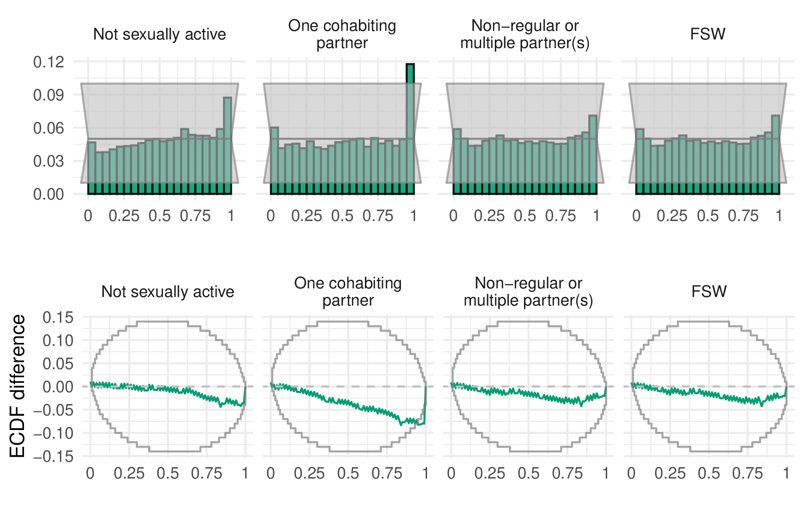

Recently the first paper [@howes2023spatio] from my PhD was published!
It represents many hours of work.
Exactly how many I might prefer not to think about.
It would be odd to allocate all that effort to writing a paper^[That presumably few people will read.] and not think it's also worthwhile to write an informal discussion.
So here it is!
The sections are quite disjoint, and can be read in any order, though starting with the summary first would make sense.
If there are parts of the post you like, don't like, agree with, disagree with, or otherwise have thoughts about, please have a low bar to reaching out to let me know!

# Related to HIV

## Summary

The risk of an individual acquiring HIV is, roughly speaking, proportional to the amount of unsuppresed viral load among their sexual partners.
For this reason, measuring sexual behaviour is a natural thing to do to help us understand, and optimistically effectively respond to, HIV epidemics.
Ideally these estimates should be accurate, timely, and at an appropriate^[Exactly what "appropriate" means is a topic one could spend a long time arguing about.] geographic resolution to be useful to policy makers.

We focused on adolescent girls and young women (AGYW), a demographic group particularly at risk of HIV^[A major feature of the HIV/AIDS response globally is to focus efforts on those populations most at risk of HIV infection. This is exemplified by the [Global AIDS Strategy 2021-2026](https://www.unaids.org/en/resources/documents/2021/2021-2026-global-AIDS-strategy), whose headline is: "End inequalities. End AIDS.".].
One reason the risk is particularly high is the age-dynamics of sexual mixing: AGYW tend to have older male partners, and because risk of HIV is cumulative, those partners are more likely to have unsuppressed HIV.

| Risk group                         | Risk ratio $r$ |
|------------------------------------|------------|
| 1. Not sexually active                | 0          |
| 2. One cohabiting partner             | 1          |
| 3. Multiple or non-regular partner(s) | 1.72       |
| 4. Female sex workers                 | 13         |

Using [a Bayesian hierarchical model of household survey data](https://github.com/athowes/multi-agyw), we estimated the proportion of AGYW who belong to each of four (mutually exclusive by definition) risk groups, defined in the above table.
The second column of the table contains risk ratios^[Obtained from the [ALPHA Network](https://alpha.lshtm.ac.uk/).]: a value of $r$ means that in the next year, the probability of acquiring HIV for a member of that risk group is $r$ times higher than the baseline group, those with one cohabiting partner.

Figure \@ref(fig:map) illustrates some example results for two of the risk groups.
I highlight this map because it shows a striking difference in behaviour across space: for women 20-29, in eastern Africa cohabiting is more common, and in southern Africa multiple or non-regular partner(s) are more common.
If someone can explain this difference, please let me know!

```{r map, echo=FALSE, fig.cap='Posterior mean estimates for the "one cohabiting partner" and "multiple or non-regular partner(s)" risk groups among women 20-29.', out.width = '90%'}

```

Figure \@ref(fig:bimodal) shows another view of this spatial bimodality in the 20-24 and 25-29 age groups.

```{r bimodal, echo=FALSE, fig.cap='Density of risk group membership by age group.', out.width = '90%'}

```

## Prioritisation by strata

After generating estimates for the four risk groups, we were especially interested to answer the question: "How worthwhile is it to prioritise HIV interventions for AGYW on the basis of behaviour, as recommended by the [Global AIDS Strategy 2021-2026](https://www.unaids.org/en/resources/documents/2021/2021-2026-global-AIDS-strategy)?".

To do this, we started by estimating HIV prevalence, HIV incidence, and expected new HIV infections stratified by age, district and risk group.
We then calculated the cumulative expected new HIV infections that "could"^[I use scare quotes here because there are some quite significant caveats, or assumptions made here.] be found when prioritising according to different types of strata^[For a clearly illustration of how this works, see [Slide 22](https://athowes.github.io/multi-agyw/14-10-22-waterloo.pdf) onward in this presentation.].
If you are interested, the results of this analysis applied to all countries are discussed in the paper.

As an illustration, let me specifically pick out two countries here, Botswana and Mozambique.
The reason I choose these countries is because they represent two extremes.
Specifically, when fitting models to the countries individually, the spatial random effect in Botswana explains almost none of the variation in risk group proportions (Figure \@ref(fig:var-prop))
On the other hand, the spatial random effect in Mozambique explains a significant proportion of the variation.

```{r var-prop, echo=FALSE, fig.cap="The proportion of posterior variance in risk group proporitons explained by each random effect. To get this right, care was required with sum-to-zero constraints to make sure each random effect was only doing the job it was intended to do.", out.width = '90%'}

```

This contrast is reflected in the efficiency plots^[I made up this name. Is there an existing or better one?] for the two countries, Figure \@ref(fig:bwa) and Figure \@ref(fig:moz).
To explain what is going on here, the baseline in grey shows the rate of "finding" new infections you could achieve if you simply chose individuals at random.
If you have some information, say about the average incidence by age, then you can do better than random, by first prioritisting the highest incidence age group.
Likewise if you have the average incidence by any of the other strata, listed along the right hand side of the plot.
The more information you have (trivially according to the simple model I present, but unrealistically in practise) the better you can do.
So, returning to the importance of space in the two countries, notice that the blue line labelled "area" is much further away from the grey baseline in Mozambique than it is in Botswana.
As to how this might translate into a more concrete recommendation, I think it would be much more reasonable to have a single policy across Botswana than it would be across Mozambique for example.

```{r bwa, echo=FALSE, fig.cap='Efficiency plot for Botswana.', out.width = '90%'}

```

```{r moz, echo=FALSE, fig.cap='Efficiency plot for Mozambique.', out.width = '90%'}

```

## Use by countries as a tool

A static PDF document in a journal is not a good way to disseminate estimates intended to be used in a changing policy setting.
Instead, [Kathryn Risher](https://www.imperial.ac.uk/people/k.risher) has created a spreadsheet tool which is beginning to see use by country teams.
Any statistical analysis integrated into a tool must be designed to be used many times, across varying settings, and by a variety of users.
These requirements are quite different from those of a single, fixed analysis, run by the developer of the analysis.
I have tried to write the code keeping this in mind^[Besides, many things required for multiple analysis are best practice for a single analysis. You don't really want to handle tens of countries ad-hoc.], but there is a lot more that could be done.

Sharing estimates with country teams is a good opportunity to get feedback and improve the work.
My understanding of the surrounding context in each country is limited so there is a lot that could be learned from domain experts.
Though there has been some positive feedback regarding the tool, there has also been negative feedback.
In particular, the concern is regarding population size and prevalence estimates for female sex workers in Malawi being different to what was expected based on other data sources.
I won't talk about about the technical details here, but it is worth saying that the estimates for the female sex worker risk group are those I have the least confidence in, as they are based on the lowest quality data.
It's worth asking if this issue is something that could have been avoided with earlier engagement of relevant stakeholders in the estimates process.
I hope that as the work matures, iterative improvements to estimates process can be made.
For example, rather than an external spreadsheet tool being provided, it would both enhance the accuracy of the estimates, as well as strengthen trust in their provenance, for country teams to produce them.
This is the approach used by the [Naomi model](https://naomi.unaids.org/login), which is used to produce estimates of HIV prevalence, HIV incidence, and ART coverage^[And I’m sure that there are never any issues with those estimates! If it’s not clear, that’s a joke, there will always be issues, but I do think their rate and or significance will be lower than a model where estimates are produced externally.].

## Potential impact

### Theory of change for more accurate measurements

The case for how this work might be impactful is clear.
There aren't enough resources to provide costly, intensified interventions to everyone.
Any measurement which enables their delivery to be prioritised has potential value.
However, this potential value rests on the success of the interventions, and it is by no means easy for an intervention to be "successful".

There are many things that need to "go right" to create impact.
One model I have heard for this is to think in terms of a chain, where any one link in the chain "going wrong" can jeopardise success.
This work is high up on the chain: if it is broken, and inaccurate information is passed down, then the prospects for success don't look good.
But there is still a lot that could go wrong further down the chain.

One mindset, as a statistician, would be to think: "My job is to do the best I can at measurement. I shouldn't concern myself too much with all the complexities further down the chain".
There are a couple of reasons I think this mindset, though it can be helpful, is lacking.
First, perhaps the primary determinant of our impact is which projects we work on.
Unless you are willing to delegate all of that thinking away, then to work on impactful projects you have to consider how the measurements in the end are going to be used and what effect it will have on the world.
Second, I am doubtful it is possible to produce a statistical analysis which is entirely agnostic as to its use^[Connection here to a previous catchily titled blog post: [Some thoughts on reporting a (posterior) distribution](https://athowes.github.io/posts/2020-11-30-some-thoughts-on-reporting/). It's difficult to separate the science from the scientist and their aims.].
And, even if it were possible, it's not clear that it's a good idea.
There will always be many [analyst degrees of freedom](https://en.wikipedia.org/wiki/Researcher_degrees_of_freedom).
Rather than pretend they don't exist, it seems preferable to make deliberate choices with the use-case in mind.

### Was a model for the data required?

In small-area estimation^[The name "small-area estimation" is a bit of a misnomer. Really, the name "small-data estimation" is better suited.], we try to estimate quantities using a model when the direct estimates are too noisy (and sometimes biased) to be reliably used.
Figure \@ref(fig:sae) shows an comparison of direct estimates, only based on the data, and the modelled estimates we produced.
I like using this figure in presentations as it's quite clear that the direct estimates don't look reasonable.
The problem is that they are not based on very much data^[Even better if I showed you this in a plot of the sample sizes!].
Using a model fixes this problem, and so I think is required in this situation.

```{r sae, echo=FALSE, fig.cap="Even without real covariates, small-area estimation is doing something useful. The direct estimates are very noisy due to their small sample sizes. Furthermore, some districts have no survey clusters. These issues are alleivated using simple smoothing.", out.width = '90%'}

```

Another place where the modelling played an important role is for the female sex worker risk group.
One challenging feature of the data is that not all of the surveys we wanted to include had a specific question about transactional sex (Figure \@ref(fig:data)).
To overcome this limitation of the data, we used a two-stage model.
First, we used all the surveys to fit a multinomial regression where the categories are:

* Not sexually active
* One cohabiting partner
* Multiple or non-regular partner(s) or female sex workers

We then fit a separate logistic regression to separate the highest risk group into two, using only those surveys with a transactional sex question.

```{r data, echo=FALSE, fig.cap="The surveys we included in our analysis.", out.width = '90%'}

```

# Statistical

## Multinomial regression in `R-INLA`

We used the statistical software `R-INLA` to implement inference for the model via integrated nested Laplace approximations [@rue2009approximate].
For spatio-temporal models, INLA usually has comparable accuracy to Markov chain Monte Carlo, but is significantly faster.
For more information, see the `R-INLA` project [website](https://www.r-inla.org/).

Multinomial regression models are not straightforwardly comptible with `R-INLA`.
As such, we used the well-known^[In some circles.] multinomial-Poisson transformation (or Poisson trick) to reformulate the model as a Poisson regression.
In paricular, suppose we would like to model the probability $p_k$ of an individual being in one of $K$ categories $k = 1, \ldots, K$.
In the multinomial regression formulation, we would model log-ratios of the form
$$
\log \left( \frac{p_k}{p_K} \right) = \eta_k
$$
for $k = 1, \ldots, K - 1$, where $\eta_k$ are some linear predictors^[Putting the $K$th probability in the denominator, as what is sometimes called the reference category, is just one way to do this, there are many other valid approaches. Only $K - 1$ equations are needed because the category probabilities are mutually exhaustive such that $\sum_k p_k = 1$.] and a sample of size $m$ would have the multinomial likelihood
$$
(y_1, \ldots, y_K)^\top \sim \text{Multinomial}(m; \, p_1, \ldots, p_K).
$$
The reason this likelihood is not compatible with `R-INLA` is because it relies on an inverse link function $g: \mathbb{R}^{K - 1} \to [0, 1]$, which takes more than one linear predictor as input
$$
p_j = g(\eta_1, \ldots, \eta_{K - 1}) = \frac{\exp{\eta_j}}{1 + \sum_{k = 1}^{K - 1} \exp{\eta_k}}.
$$
However, it is possible to equivalently write the model as a Possion regression that *is* compatible with `R-INLA` as follows
\begin{align*}
y_k &\sim \text{Poisson}(\kappa_k) \\
\log(\kappa_k) &= \eta_k
\end{align*}
for $k = 1, \ldots, K$, for certain choice of linear predictor $\eta_k$.

I will try to give an intuitive explanation for the equivalence of the two models.
First, it's quite well known that conditional on their sum, Poisson random variables have a multinomial distribution.
Given this fact, notice that there are $K$ equations here, when really we only have $K - 1$ pieces of information.
The additional quantity being estimated is exactly the sum, in other words the sample size, which is modelled as random according to
$$
m = \sum_k y_k \sim \text{Poisson} \left( \sum_k \exp \eta_k \right).
$$
But wait, we know the sample size, so it's data and should be fixed -- no?
The trick is by smart choice of $\eta_k$ we can set things up so that $m$ is perfectly estimated, essentially as though it were fixed.
In particular, this smart choice is to set $\eta_k = \theta + \ldots$ where $p(\theta) \propto 1$.
I call $\theta$ an "observation-specfic" random effect.
The reason this works is because:

1. Inference for $\theta$ allows perfect recovery of $m$^[Note that there are some tricky questions here as to what it means to simulate data from this model, since doing so naively would result in varying values for $m$. I got around this by first simulating probabilities, then simulating multinomial observations from those probabilities.].
2. Changing $\theta$ does not change the category probabilities -- which at the end of the day are the thing we are interested in. This can be seen as follows
$$
p_j = \frac{\exp{\eta_j}}{\sum_{k = 1}^K \exp{\eta_k}} = \frac{\exp{(\eta_j + \theta)}}{\sum_{k = 1}^K \exp{(\eta_k + \theta)}}.
$$

Invariance to addition of a constant is also something to keep in mind when specifying the rest of the model structure.
Changing the category probabilities requires the linear predictors to vary by category.
As a result, all other random effects in the model must be interacted with category, otherwise they will have no effect.

For two-way interactions this is quite easy.
For example, to specify IID age effects, we would use something like

```r
+ f(age_idx, model = "iid", group = cat_idx,
    control.group = list(model = "iid"), constr = TRUE,
    hyper = multi.utils::tau_pc(x = 0.001, u = 2.5, alpha = 0.01))
```

For three-way interactions it's a little harder, and depending on the type of structure you might run into road-blocks.
For example, I wanted to include space-time interactions: which would have to be implemented as space-time-category interactions.
With some effort I was able to write these models, and fit them to single countries, but when trying to fit to all countries jointly the computation got prohbitive.

For further reading, you could try the paper's [mathematical appendix](https://athowes.github.io/multi-agyw/appendix.pdf) or [code](https://github.com/athowes/multi-agyw/blob/master/src/aaa_fit_multi-sexbehav-sae/script.R).

## Model assessment

We selected the final model to used, for both the multinomial and logistic regressions, based on the conditional predictive ordinate (CPO) criterion [@pettit1990conditional].
This was mostly done for convenience: the CPO can be calculated in `R-INLA` without requring model refitting.
Although the models we considered were not very computationally intensive when fit to individual countries, running all of the countries jointly was relatively involved.
As such, refitting the model many times in any kind of cross-validation scheme is unappealing.
I do think there is more that could have been done here with more thought though, and will keep trying to stay up to date with Aki Vehtari's [model selection notes](https://avehtari.github.io/modelselection/).

Having fit the model, we did try to assess coverage in a relatively modern way.
In particular, we used probability integral transform (PIT) histograms and empirical cumulative difference function (ECDF) difference plots.
For the ECDF difference plots, we used the simultaneous confidence bands of @sailynoja2022graphical.
As to what these plots are, I'm sure there are better sources, but you could try this lab meeting [presentation](https://athowes.github.io/multi-agyw/30-11-21-coverage.pdf) I gave -- Figure \@ref(fig:calibration) contains the first slide of which.

```{r calibration, echo=FALSE, fig.cap="An enticing slide.", out.width = '90%'}

```

Anyway, the results of this analysis, faceted by risk group, are shown in Figure \@ref(fig:coverage).
Although this exercise did increase my confidence in the estimates produced being reasonable, I have not yet figured out how to consistently use diagnostics like this to iteratively improve the model.
For example, the results here suggest that, for the one cohabiting partner risk group, too often the quantile of the data within the posterior predictive distribution is in the upper tail.
This is interesting to know, but how should the model be altered based on this information?
In other situations, for example if the pattern was either "U" or "V" shaped, I might have some suggestions, but here I'm unsure.

```{r coverage, echo=FALSE, fig.cap="PIT histograms and ECDF difference plots for our final model.", out.width = '90%'}

```

## Joint variance priors

Working on spatial statistics you come across some good ideas about prior specification^[Thanks Dan Simpson!].
One of these good ideas is that we should try to place priors on quantities we can interpret, and ideally have some domain knowledge about.
For example, one could try to specify priors for the amount of structured spatial variation and the amount of unstructured spatial variation -- as in the BYM model [@besag1991bayesian]) -- but it'd be far easier to specify priors for the total amount of spatial variation and the proportion of it you think is structured -- as in the BYM2 model [@simpson2017penalising].

While working on this project I was adding random effects to the model, each of which with the same penalised complexity prior on the standard deviation, and it occurred to me that this was inadvertently altering my prior on the total amount of variation in risk group proportions, which isn't something I had been meaning to do.
As such, it could be preferable to specify a prior for the total amount of variation, and the proportion attributable to each random effect.
I think this was a good idea, because someone else did it recently in a paper called "Intuitive joint priors for variance parameters" [@fuglstad2020intuitive] with an accompanying R package called `makemyprior`.
Although in the end I didn't try these types of prior in this work, it's definitely something I will attempt in future -- as well as more generally being thoughtful about prior specification whenever possible.

# Other

## Paper writing workflow

All materials relating to the paper^[Including the code, manuscript, appendix, presentations, and replies to reviews.] are available on [Github]((https://github.com/athowes/multi-agyw)).
I made relatively extensive use of Github, partially because I think open science is important, and partly because seeing little green dots makes feel as though things are moving forward^[Which is helpful for things like PhDs where motivation is usually more internal than external.].
Within the repository, I used the `docs` sub-folder to host a Github pages [website](https://athowes.github.io/multi-agyw/) with statically generated HTML webpages.
For this project, I mostly used this as a way to host presentations^[In later work, my use of the pages feature has become much more obnoxious (e.g. using it to host large R Markdown notebooks).].

The repository is structured using [`orderly`](https://github.com/vimc/orderly), a workflow package developed within the [MRC GIDA](https://reside-ic.github.io/).
This package, and the existing research infrastructure of the HIV Inference Group^[Such as processed shapefiles for each of the countries.], made doing this work significantly easier, and the end product better.
Rather than me doing a subpar job telling you about it, take a look a this presentation by Rich FitzJohn (2023): [Have I got Data for You? Data versioning and management in a pandemic](https://docs.google.com/presentation/d/1AMYL1ui4aKQt75NYKoIR9ERy2-R0KO6cpHacWuIBi2c/present#slide=id.p).

The paper was written using R Markdown, together with the `rticles` package to provide journal-specific formatting.
The main benefit of using R Markdown and `orderly` together is that the paper can be automatically updated once work upstream changes.
This includes inline numbers, tables (generated using `gt`), and figures (generated using `ggplot2`).
If these changes had to be made manually, even putting aside the time it would take, the chance of making an error is much higher.
The downside of doing things this way is that it's slightly annoying to collaborate with others.
The option I went with was to generate a `.tex` file from R Markdown, then upload it to [Overleaf](https://www.overleaf.com/) for coauthors to give input, which worked well enough.

## Personal reflection

I'm glad I got the opportunity to do some substantive applied statistics during my PhD.
People really do care about the numbers reported in the paper, and that's very motivating, if a little scary.
Even putting aside the fact that I think the point of our work should be to have impact measured in QALYs rather than citations, I've found it helpful to do this work for my development as a statistician.
In particular, I think it's given me some amount of perspective as to which things *really* matter to an analysis.
Without high quality data, and robust pipelines to handle it, there is little point in our contrived [models for spatial structure](https://github.com/athowes/areal-comparison) or baffling [inference procedures](https://github.com/athowes/elgm-inf), as interesting as they may possibly be.
This point has been clearly articulated by Max Roser of [Our World In Data](https://80000hours.org/podcast/episodes/max-roser-our-world-in-data/), where during the COVID-19 pandemic the world failed to meet even basic data needs.
This gives me some pause as a statistician.
I like models and personally enjoy modelling, but if I care about impact, am I wasting my time doing this work, rather than attempting to intervene somewhere along the pipeline with higher leverage?

In a similar vein, one could argue that statistics as a field is [failing to help scientists uncover the truth](https://www.sciencefictions.org/) -- in other words, to do good science.
Sure, it's true there are plenty of other systemic factors and incentive structures holding things back.
But when there is so much work built on unsound use of statistics you would have to hope that we as a field could do better.
I don't know what that looks like^[Popularising [Bayesian workflow](https://arxiv.org/pdf/2011.01808.pdf)? Late-stage methods development? Shaming people with funnel plots or p-curves?], but if anyone has any ideas my inbox is open!
