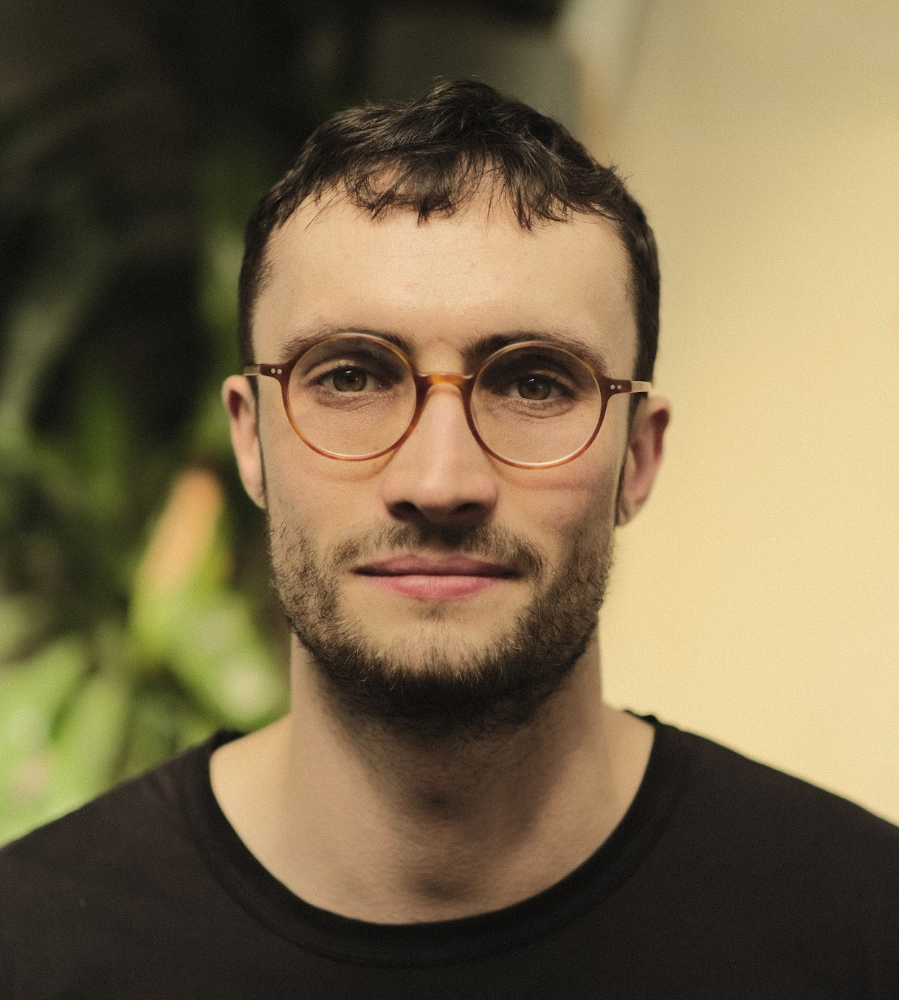

```{css echo = FALSE}
d-title {
    visibility: hidden;
  }
```


::: {.floating}

```{r echo=FALSE, out.width='30%', out.extra='style="float:right; padding:15px"'}

```

Hi!
I'm Adam, a Bayesian statistician and data scientist.
I like problems where the data are sparse, noisy, biased, or hard won, and careful statistical thinking matters.

I work with the CDC's [Center for Forecasting and Outbreak Analytics](https://www.cdc.gov/forecast-outbreak-analytics/index.html) on epidemic forecasting.
Currently, I'm building towards daily, county-level estimates of the [time-varying reproduction number](https://www.cdc.gov/forecast-outbreak-analytics/about/rt-estimates.html) using generalized additive models.
I previously focused on developing and applying [tools](https://github.com/epinowcast/epidist) for estimating epidemiological delay distributions.

I also work with [Active Site](https://activesite.bio/) on the design and analysis of studies evaluating real world AI assistance for biological tasks [@hong2026measuring].

I completed my [PhD](https://github.com/athowes/thesis) "Bayesian spatio-temporal methods for small-area estimation of HIV indicators" at [Imperial College London](https://www.imperial.ac.uk/) with [Seth Flaxman](https://sethrf.com/) and [Jeffrey Imai-Eaton](https://www.imperial.ac.uk/people/jeffrey.eaton).
I worked on comparing models for area-level spatial correlation, estimating district-level HIV risk group proportions [@howes2023spatio; [SHIPP](https://hivtools.unaids.org/shipp/)], and developing deterministic Bayesian inference methods [@howes2025fast] motivated by the [Naomi](https://naomi.unaids.org/login) small-area evidence synthesis model [@eaton2021naomi; @esra2024improved].
I was part of the [StatML CDT](https://statml.io/), [HIV Inference Group](https://hiv-inference.org/), and [Machine Learning & Global Health Network](https://mlgh.net/).

I've also spent time at the [MIT Media Lab](https://www.media.mit.edu/groups/sculpting-evolution/overview/) contributing to the [Nucleic Acid Observatory](https://www.naobservatory.org/) project for detecting biological threats, and at the [University of Waterloo](https://uwaterloo.ca/statistics-and-actuarial-science/) working on deterministic Bayesian inference methods.
After my PhD, I worked at the [University of Oxford](https://www.ox.ac.uk/) modelling food security with the [WFP](https://www.wfp.org/) [@ishida2025realtime], and contributed to an [individual-based model](https://github.com/mrc-ide/helios) supporting [Blueprint Biosecurity](https://blueprintbiosecurity.org/)'s far UVC roadmap.

If you're interested in collaboration or working together, please get in touch!

:::
